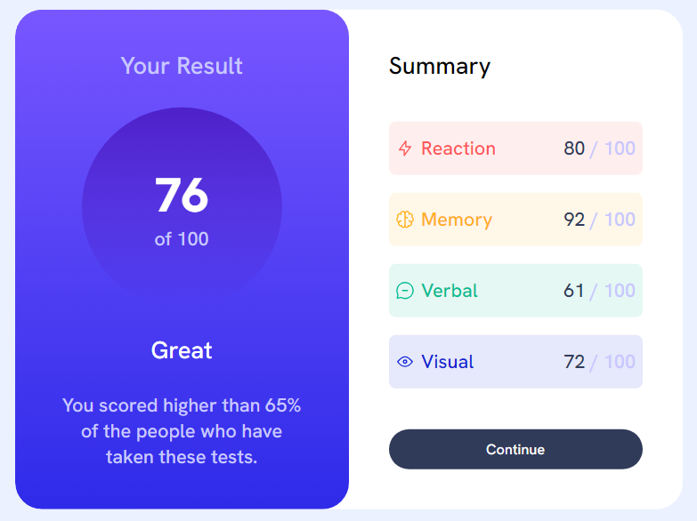

# Frontend Mentor - Results summary component solution

This is a solution to the [Results summary component challenge on Frontend Mentor](https://www.frontendmentor.io/challenges/results-summary-component-CE_K6s0maV). Frontend Mentor challenges help you improve your coding skills by building realistic projects.

## Table of contents

- [Overview](#overview)
  - [The challenge](#the-challenge)
  - [Screenshot](#screenshot)
  - [Links](#links)
- [My process](#my-process)
  - [Built with](#built-with)
  - [What I learned](#what-i-learned)
  - [Continued development](#continued-development)
- [Author](#author)

**Note: Delete this note and update the table of contents based on what sections you keep.**

## Overview

### The challenge

Users should be able to:

- View the optimal layout for the interface depending on their device's screen size
- See hover and focus states for all interactive elements on the page
- **Bonus**: Use the local JSON data to dynamically populate the content

### Screenshot

### Links

- Github URL: [Github URL](https://github.com/exchyphen/fm_qr-code-component)
- Live Site URL: [live site hosted by Github Pages](https://exchyphen.github.io/fm_qr-code-component/)

## My process

1. Scaffold HTML (containers, anything that will be a parent element)
2. Position scaffolding
3. Populate and style the child elements (text, etc)
4. Adjust styling

### Built with

- HTML
- CSS

### What I learned

More practice with HTML/CSS.

### Continued development

Recently saw the bonus challenge, will look into fetching data from a local JSON data file and dynamically populating the content.

## Author

- Github - [exchyphen](https://github.com/exchyphen)
- Frontend Mentor - [@exchyphen](https://www.frontendmentor.io/profile/exchyphen)
